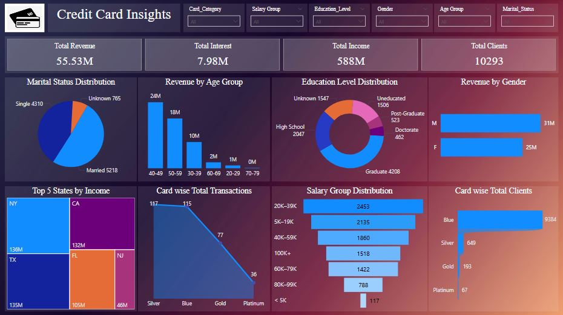

# Credit-Card-Insights-
## Power BI Project

This project analyzes credit card transaction data to identify customer spending patterns, revenue trends, and transaction behavior. An interactive dashboard was created to help stakeholders monitor financial performance and customer activity.

## Tools Covered : Advanced Excel, Power BI, Power Query

## Key Performance Indicators (KPIs):

• Total Revenue

• Total Interest

• Total Income

• Total Clients

• Marital Status Distribution

• Revenue by Age Group

• Education Level Distribution

• Revenue by Gender

• Top 5 States by Income

• Card wise Total Transactions

• Salary Group Distribution

• Card wise Total Clients

## Dashboard Visualizations:

• Cards

• Pie Chart

• Stacked Column Chart

• Donut Chart

• Stacked Bar Chart

• Treemap

• Line Chart

• Funnel

## Interactive Features:

• Slicers

## Dashboard Preview

